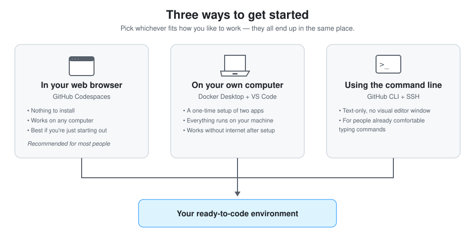
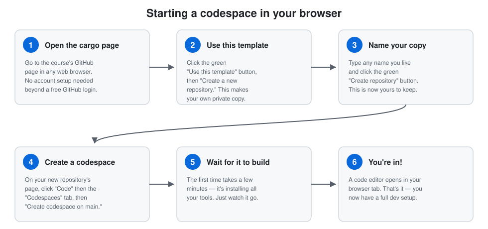
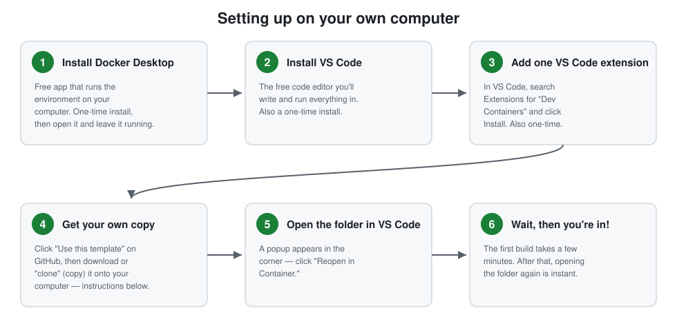
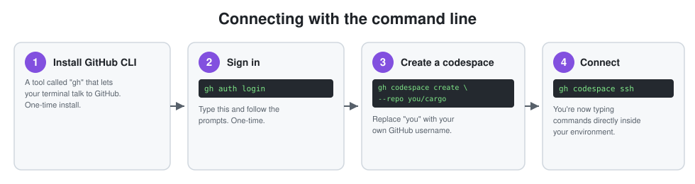

# Cargo

This repository gives you a complete, ready-to-use coding environment for
this course — the same databases, tools, and settings every student and
your instructor use, already set up. You won't need to install a
programming language, a database, or any of the other tools by hand.

This guide assumes you've never used a terminal (the black window where
you type commands) before, on any computer. Every step is spelled out. If
a word might be unfamiliar, it's explained the first time it comes up.

---

## Three ways to get started

There are three ways to work in this environment. They all end up giving
you the exact same tools — pick whichever fits how you want to work.



| | Best if... | Setup required |
|---|---|---|
| **[In your browser](#option-a-in-your-browser-easiest)** | You want the fastest start, or you're on a school/shared computer | None — just a free GitHub account |
| **[On your computer](#option-b-on-your-own-computer)** | You want everything running locally, including offline | Two free apps, installed once |
| **[Command line](#option-c-using-the-command-line-advanced)** | You're already comfortable typing commands | One free tool, installed once |

**Not sure which to pick? Choose Option A.** It's the easiest to start
with, and you can always switch to Option B later without losing anything.

---

## Option A: In your browser (easiest)

This uses a free GitHub feature called **Codespaces**, which runs your
entire environment on GitHub's computers. You just need a web browser and
a free [GitHub account](https://github.com/signup).



### Step by step

1. **Open this repository's page on GitHub** (if you're reading this on
   GitHub already, you're there — otherwise ask your instructor for the
   link).

2. **Click the green "Use this template" button**, near the top of the
   page, then choose **"Create a new repository."** This makes your own
   personal copy that only you can edit — nothing you do affects anyone
   else's copy, including your instructor's.

3. **Give your copy a name** (anything you like — for example,
   `my-coursework`) and click the green **"Create repository"** button.
   GitHub will take you to your new copy's page after a few seconds.

4. **Click the green "Code" button**, then click the **"Codespaces"** tab
   inside the panel that opens, then click **"Create codespace on
   main."**

5. **Wait for it to build.** The first time only, this takes a few
   minutes — it's installing everything you need. You'll see progress
   messages. You don't need to do anything but wait.

6. **You're in!** A code editor (called VS Code) opens right in your
   browser tab, already connected to your environment. Look for a
   **Terminal** panel near the bottom — that's where you'll type commands
   when instructions ask you to.

### Coming back later

Next time, go to [github.com/codespaces](https://github.com/codespaces) —
your codespace will be listed there. Click it to reopen exactly where you
left off. (After 30 minutes of not using it, it pauses automatically to
save resources — reopening it just takes a few seconds to resume.)

---

## Option B: On your own computer

This runs the same environment directly on your computer instead of in
the browser. It takes a bit more setup up front, but afterward, opening it
is as fast as opening any other app.



### Step by step

1. **Install Docker Desktop.** This is the free app that actually runs
   your environment. Download it from
   [docker.com/products/docker-desktop](https://www.docker.com/products/docker-desktop/)
   and install it like any other application (Mac: drag it to
   Applications; Windows: run the installer). **Open it once after
   installing** and leave it running in the background — you'll see a
   whale icon in your menu bar (Mac) or system tray (Windows) once it's
   ready.

2. **Install VS Code.** This is the free code editor you'll use for
   everything. Download it from
   [code.visualstudio.com](https://code.visualstudio.com/) and install it
   the same way.

3. **Add one extension to VS Code.** Open VS Code, click the Extensions
   icon in the left sidebar (it looks like four small squares), search
   for **"Dev Containers,"** and click **Install** on the one published by
   Microsoft.

4. **Get your own copy of this repository.** Two ways to do this —
   either works:

   - **Easiest:** Back on this repository's GitHub page, click **"Use
     this template" → "Create a new repository,"** name it, and click
     **"Create repository."** Then, in VS Code, open the Command Palette
     (<kbd>Cmd</kbd>+<kbd>Shift</kbd>+<kbd>P</kbd> on Mac,
     <kbd>Ctrl</kbd>+<kbd>Shift</kbd>+<kbd>P</kbd> on Windows), type
     **"Git: Clone,"** press Enter, and paste in your new repository's
     URL (copy it from the green "Code" button on its GitHub page). VS
     Code will ask where to save it on your computer, then open it.
   - **If you prefer the terminal:** open a terminal (Mac: the
     "Terminal" app, found via Spotlight search; Windows: "Git Bash," if
     you've installed [Git for Windows](https://git-scm.com/download/win),
     or the "Terminal" app) and run:
     ```bash
     git clone https://github.com/<your-username>/<your-repo-name>.git
     ```
     replacing the URL with your own copy's URL from its "Code" button.

5. **Open the folder in VS Code**, if it isn't already open. A small
   popup appears in the bottom-right corner asking **"Reopen in
   Container?"** — click it. (If you miss the popup, open the Command
   Palette and run **"Dev Containers: Reopen in Container."**)

6. **Wait for it to build**, then you're in. Just like Option A, the
   first time takes a few minutes. Every time after that, it opens in
   seconds.

---

## Option C: Using the command line (advanced)

If you're already comfortable typing commands, you can skip the visual
editor entirely and work from a terminal connected directly to your
environment.



1. **Install the GitHub CLI** (a tool called `gh`) — instructions for
   every operating system are at
   [cli.github.com](https://cli.github.com/).

2. **Sign in:**
   ```bash
   gh auth login
   ```
   Follow the prompts (choose GitHub.com, HTTPS, and "Login with a web
   browser" if asked).

3. **Create your own copy and a codespace for it**, in one step:
   ```bash
   gh repo create my-coursework --template timdrichards/cargo --clone
   cd my-coursework
   gh codespace create --repo <your-username>/my-coursework
   ```
   (Replace `<your-username>` with your own GitHub username.)

4. **Connect to it:**
   ```bash
   gh codespace ssh
   ```
   You're now typing commands directly inside your environment.

---

## What's inside

Once you're in, you have a full development setup: a code editor, a
terminal, and — when you need them — databases and other services
(Postgres, MongoDB, Redis, and more) that start on request. You don't need
to know about most of this on day one; your course material will
introduce pieces as you need them.

- **[doc/](doc/)** — more detailed guides, including how to get updates.
- **[work/](work/)** — put your own projects and repositories here. Unlike
  the rest of this repository, anything you put in `work/` is yours —
  it's never tracked or touched by updates.

## Getting updates

Your instructor may occasionally improve this environment after you've
already started. See **[doc/UPDATING.md](doc/UPDATING.md)** for how you'll
be notified and how to pull those changes in — it's just as
beginner-friendly as this page.

## Getting help

If something doesn't work, or a step above doesn't match what you're
seeing, ask your instructor or a TA rather than guessing — dev environment
issues are almost always quick to fix with a look at what's actually on
your screen.
